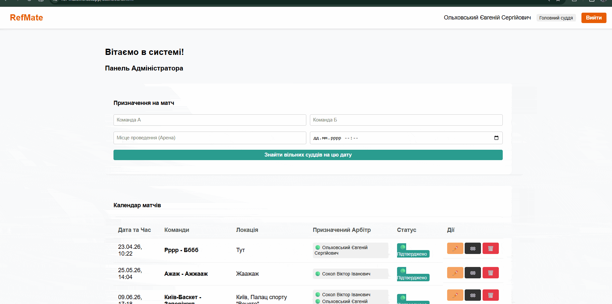
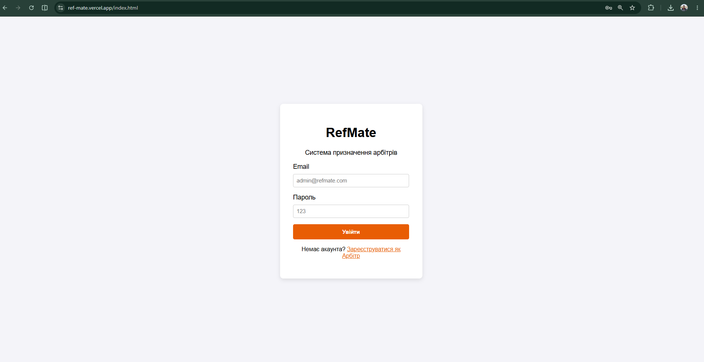

# RefMate (Referee Management Platform)

RefMate is a custom full-stack web application engineered to streamline scheduling, communication, and comprehensive data management for basketball referees.

## Project Links
🚀 **Live Demo:** [https://ref-mate.vercel.app/](https://ref-mate.vercel.app/)  
*(Note: Initial live demo loading may take up to 2 minutes due to free tier backend spin-up on Render).*

💻 **GitHub Repository (Frontend & Backend):** [https://github.com/Evgeniy45/RefMate](https://github.com/Evgeniy45/RefMate) 

---

## Technologies Used 💻

### Frontend
* **HTML5 & CSS3** — Semantic structure and standard layouts.
* **SCSS / SASS** — Advanced, modular styling with centralized abstract rules and structural variables.
* **Vanilla JavaScript (ES6+)** — Interactive DOM manipulation and application logic.
* **Fetch API** — Handles efficient asynchronous remote server requests and global data streams.
* **SweetAlert2** — Elegant, responsive custom popup dialogs and system alerts notifications.

### Backend & Core Logic
* **Java & Spring Boot** — Core enterprise backend architecture, REST API controller layers, and business services handling.
* **Spring Security & JWT (JSON Web Tokens)** — Bulletproof user authentication, stateful/stateless validation, and role-based route protection.
* **SMTP Server** — Automated transactional email dispatches for user registration confirmations and scheduler notices.

### Database & Storage
* **PostgreSQL** — Relational database infrastructure for reliable user data, referee schedules, and games storage.
* **Neon** — Serverless PostgreSQL cloud data storage framework handling database host routines.

### Deployment & Tools
* **Docker** — Containerization tool ensuring environment parity across development and deployment.
* **Render** — Remote cloud hosting for the Java backend architecture.
* **Vercel** — Ultra-fast production deployment pipeline for the modular frontend application.

---

## Features

Highlighting the key implementation capabilities that make the project stand out:

* **Interactive Dynamic Calendar:** Visually rich grid component optimizing the scheduling process for users and matching availability matrices dynamically.
* **Precise Sorting Logic:** Algorithmic automated filtering routines that sort system matches and scheduling variables based on user parameters.
* **Role-Based Authentication:** Complete system signup, registration validation flows, and protected secure paths guarded by JWT validation.
* **Responsive Web Design (RWD):** Tailored structural fluid layout reflows optimized for multiple screens (Desktop, Tablet, Mobile).
* **Automated Notification Engine:** Integrated SMTP module dispatching email triggers directly linked to scheduler event hooks.

---

## Project Interface 📸

### 📅 Dashboard View


### 🔐 Secure Authentication


---

## Local Setup

Follow these instructions to spin up the local environment:

### 1. Database Configuration
Ensure you have a local PostgreSQL instance running or populate your `.env` variables with your Neon database credentials.

### 2. Run Backend Services (Java + Spring)
```bash
# Navigate into the backend root folder and build the app
./mvnw clean install
./mvnw spring-boot:run
```

### 3. Serve Frontend Locally
Open the frontend folder on your machine or deploy it via a local static server configuration:

```bash
# Simply open the main index page or use Live Server extension in VS Code
open index.html
```

The application frontend will communicate natively with the server APIs running on `http://localhost:8080`.